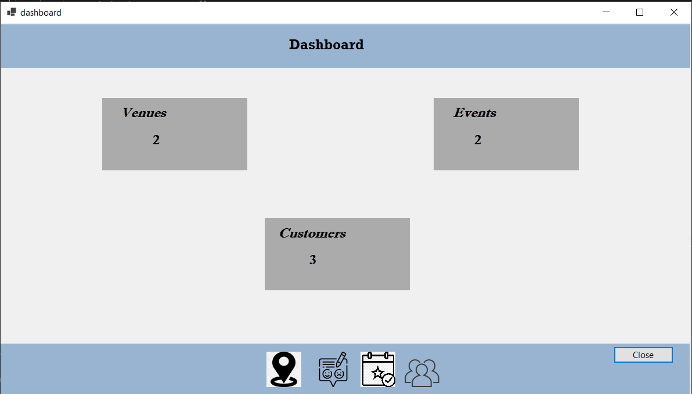
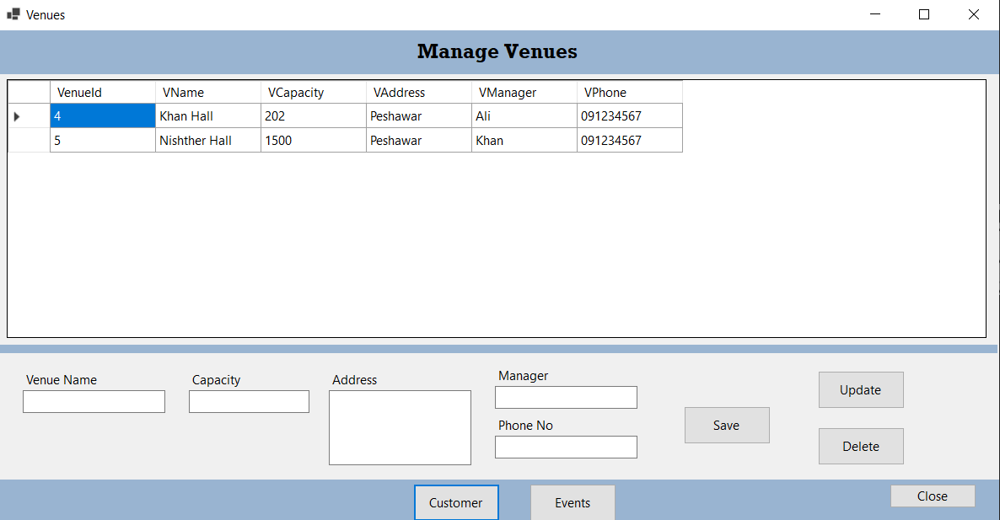
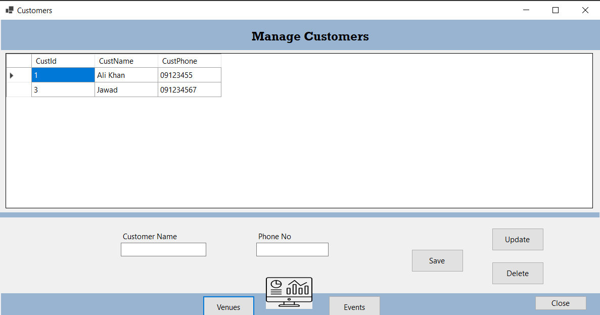
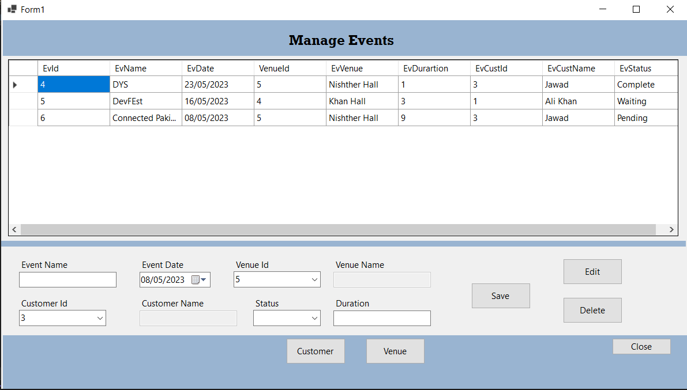
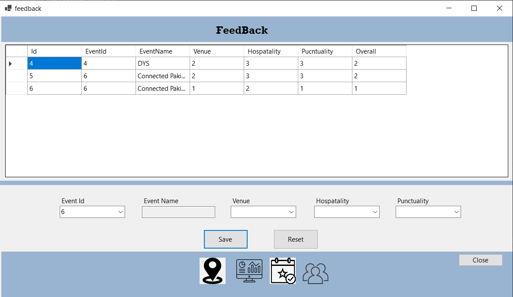

# **Event Management App**

## Introduction

This event management app is designed to simplify the process of managing events for event organizers.

## Features

The event management app includes the following features:

- **Venue Form:** Event organizers can create a profile on the app by providing their name, phone number, and venue details such as address, capacity, and manager name. 
- **Customer Form:** Event organizers can add customer details such as name and phone number. This allows organizers to keep track of customer information and use it to book events.
- **Manage Event:** The app allows event organizers to manage their events by providing event name, venue, customer, and status. This allows organizers to keep track of their events and make changes as needed.

- **Feedback Form:** The app allows event organizers to receive feedback about the venue, hospitality, and punctuality by event name. This helps improve the quality of service provided by venues and event organizers.

- **Dashboard:** The app provides a dashboard that shows the number of events, venues, and customers. This helps event organizers keep track of their business and make data-driven decisions.

## Technology

The event management app is built using C# and MySQL. The backend is written in C# and uses MySQL as the database. 

## Installation

To install and run the event management app, follow these steps:

1. Clone the repository to your local machine.
2. Import the MySQL database schema located in the database folder.
3. Open the project in Visual Studio and run the application.

## Usage
To use the event management app, follow these steps:

1. Create an account as an event organizer.
2. Create your venue profile and provide event details such as name, date, time, and venue information.
3. Add customer details such as name and phone number.
4. Book an event for the customer by selecting the event, customer, and venue from the dropdown menus.
5. Manage your events and receive feedback from customers.
6. Use the dashboard to track your business performance.

## Images

Here are some screenshots of the event management app:

*Dashboard*

*Venue Form*

*Customer Form*

*Manage Event*

*Feedback Form*

---
## Credits
Created by **Shahan Ahmad**.